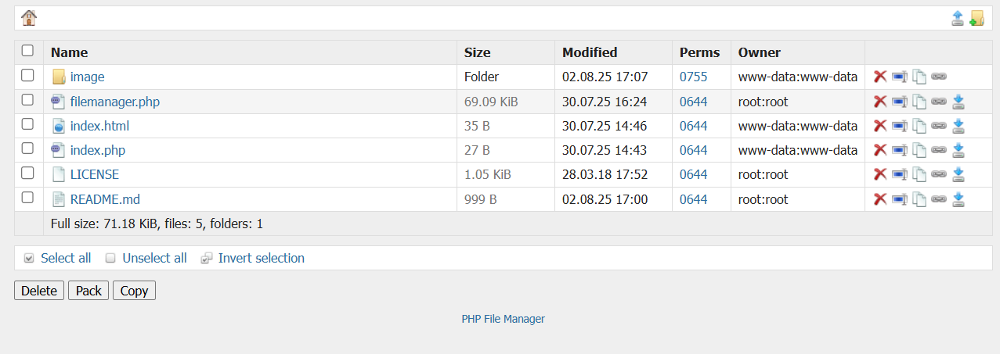

# 📂 PHP File Manager



**PHP File Manager** is a lightweight and straightforward web-based file manager built with pure PHP. It allows you to manage files and directories directly from your web browser with a clean and intuitive interface.

---

## 🚀 Features
- Upload and download files
- Rename files and folders
- Delete files
- Browse directories on the server
- View detailed file information (size, permissions, owner, modified date)

---

## ⚙️ Technologies
- PHP (no database required)
- HTML & CSS for the interface

---

## 📁 Project Structure
```plaintext
.
├── image/              # Folder containing images
├── filemanager.php     # Main file manager script
├── index.html          # HTML landing page
├── index.php           # PHP index file
├── LICENSE             # Project license
├── phpfilemanager.png  # Application screenshot
└── README.md           # This documentation file
