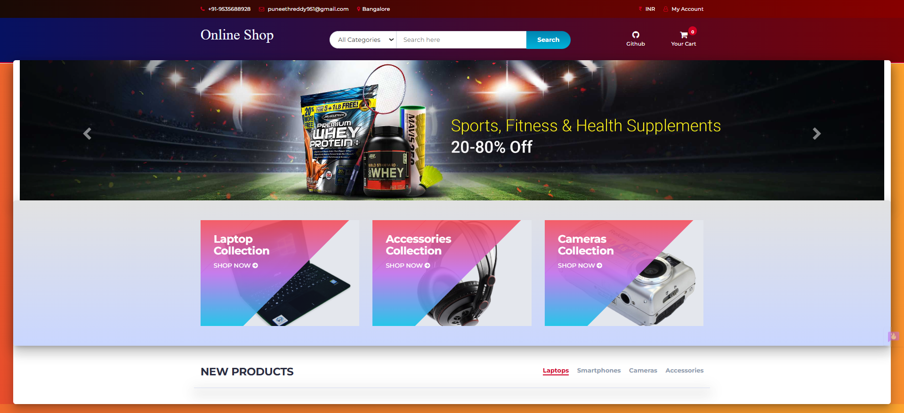

# 🛒 Online Shopping System



**Online Shopping System** is a complete web-based e-commerce platform designed to showcase, browse, and purchase products online. It provides a modern, responsive interface with easy navigation, product search, shopping cart, and account management.

---

## 🚀 Features
- Dynamic homepage with promotional banners and product categories
- Product listings for laptops, smartphones, cameras, accessories, and more
- Search functionality by category and keyword
- Shopping cart management
- User account registration and login
- Modern, responsive design compatible with all devices

---

## ⚙️ Technologies
- HTML5 & CSS3 for layout and styling
- JavaScript/jQuery for interactivity
- Bootstrap for responsive design
- PHP for server-side scripting
- MySQL (or compatible) for database

---

## 📁 Project Structure
```plaintext
.
├── assets/           # Images, CSS, JS, fonts
├── admin/            # Admin dashboard and management panels
├── includes/         # Reusable PHP files (headers, footers, configs)
├── products/         # Product detail pages
├── cart.php          # Shopping cart functionality
├── index.php         # Landing page (home)
├── login.php         # User login page
├── register.php      # User registration page
├── checkout.php      # Checkout process
└── README.md         # This documentation file
