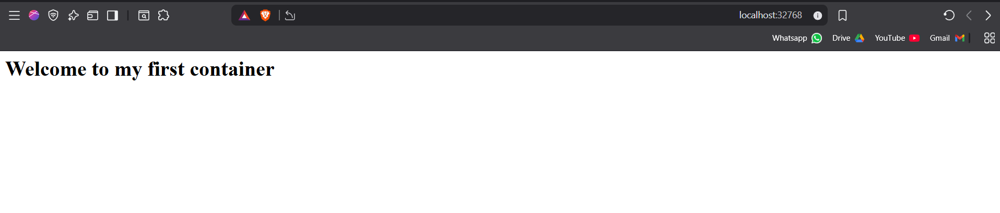
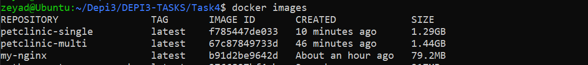

# Task 4 – Docker Practice

## Project Structure

### 1. **Dockerfile**
- **Description:**  
  A basic Dockerfile for serving static content using **Nginx**.
- **Purpose:**  
  Demonstrates the use of a lightweight web server container.
- **Key Features:**  
  - Uses `nginx:alpine` as the base image.  
  - Copies HTML files into the container.  
  - Runs Nginx in the foreground.

**Container Output Preview:**

---

### 2. **Dockerfile-multi**
- **Description:**  
  A **multi-stage build** Dockerfile for packaging a Spring Boot application.
- **Purpose:**  
  Simpler than multi-stage builds, but results in a larger image.
- **Key Features:**  
  - First stage uses Maven to compile and package the app.  
  - Second stage runs the compiled JAR on OpenJDK.  
  - Improves efficiency and minimizes unused build files.

---

### 3. **Dockerfile-single**
- **Description:**  
  A **single-layer build** Dockerfile for packaging the Spring Boot application.
- **Purpose:**  
  Reduces the final image size by separating the build and runtime environments.
- **Key Features:**  
  - Uses OpenJDK base image.  
  - Copies the entire source code and builds directly inside the container.  
  - Skips tests during build to speed up packaging.

- **Note:**  
  When combined with a `.dockerignore` file, the build context is reduced, producing smaller images compared to the multi-stage approach in some cases.

**Image Size Comparison:**

---

## How to Build & Run

**Example (multi-stage build):**
docker build -t petclinic-multi -f Dockerfile-multi .
docker run -d -p 90:80 --name petclinic-multi-cont petclinic-multi
